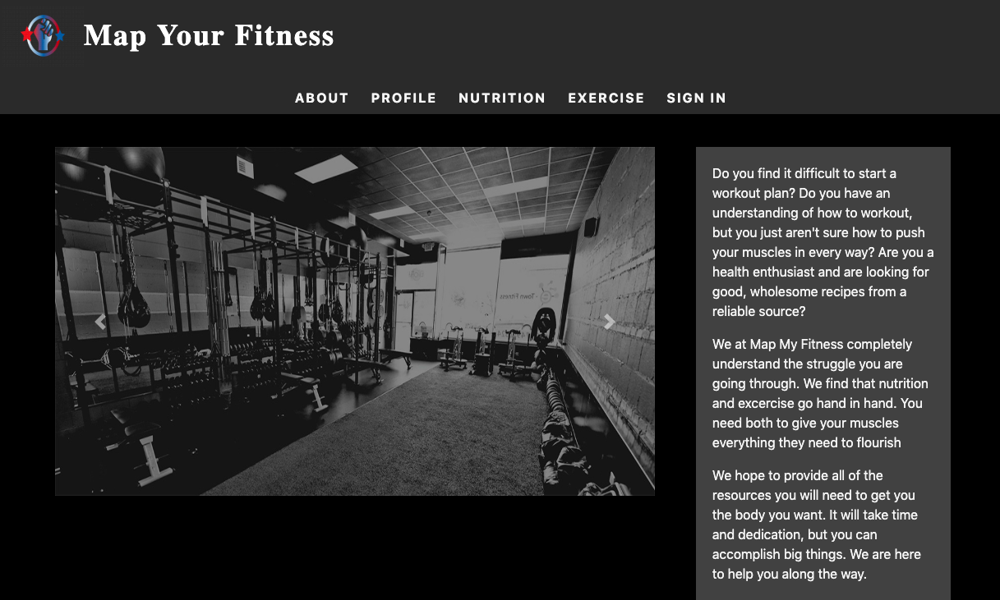
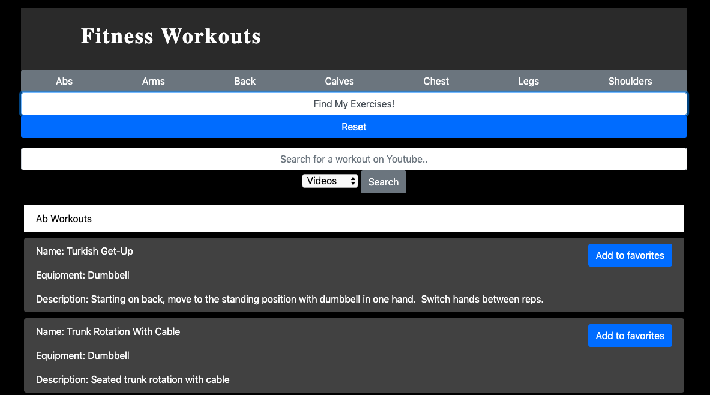
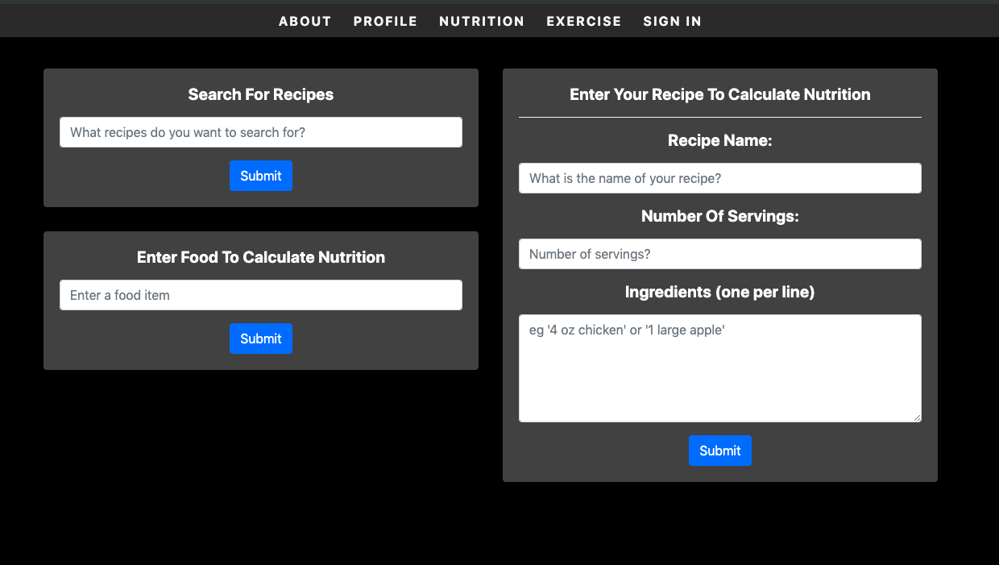

	
	<h1 align="center">Map My Fitness</h1>

Starting a new health journey can be a challenge without help.  Our goal was to provide the average individual some tools to plan their own workouts and make healthy food choices.  We accomplished this first by allowing the user to search for exercises that they can incorporate their workouts along with a YouTube search for these exercises.  Secondly, we put in a search feature for users to search for new recipes, and calculate nutrition for Individual items as well as input their own recipes to view nutritional data.

# Exercise Search
First, choose a body part to focus on and click "Find My Exercises".

# Nutrition/Recipe Search
Three Options:

1. Search for new recipes by entering search terms in the appropriate box.
2. Search for nutritional information for a single item.
3. Enter your own recipe for detailed nutritional information broken down by serving.

# Technologies used
## This project was created with:

* HTML
* CSS
* JavaScript
* jQuery
* Bootstrap
* Plotly
* AJAX
* API (WGER - Exercise, Edamam - Nutrition)

# Deployed Site:
https://austdobe.github.io/Map-My-Fitness/

# Future Development Considerations:

1. A site like this one would need some legal advice, namely to create a set of Terms & Conditions for use of the site to keep the creators free from liability due to potential injury a user might encounter with one of the exercises provided.

2. This web application would be most effective if deployed as a mobile app for iPhone and Android users.

3. It would be great if we could add the following features to promote and track factors that aid in weight loss and strength training:
	A. Allow users to track their calories for the day.
	B. Allow users to create a workout plan for each day.
	
4. Update the weight loss chart feature to show dates, as opposed to referencing each week.

# Contributors
* Austin Dober | Design & Bootstrap Implementation | https://github.com/austdobe
* Maurice Webb | Sign-up Form & Weight Loss Charting | https://github.com/moeewebb
* Jeff Swanner | Firebase & Authentication | https://github.com/jeff-swanner
* Jesse Denick | WGER API (Exercise) | https://github.com/PaolaStone
* Scott Moore | Edamam API (Nutrition) | https://github.com/hguidoum
